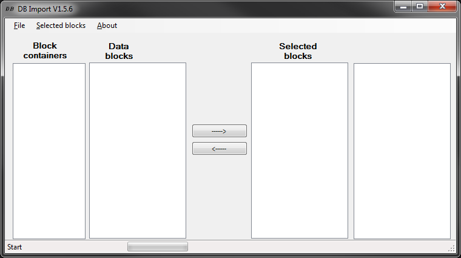
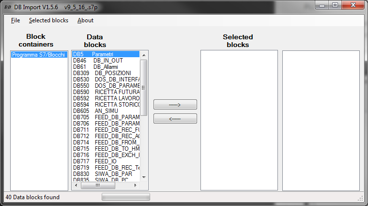
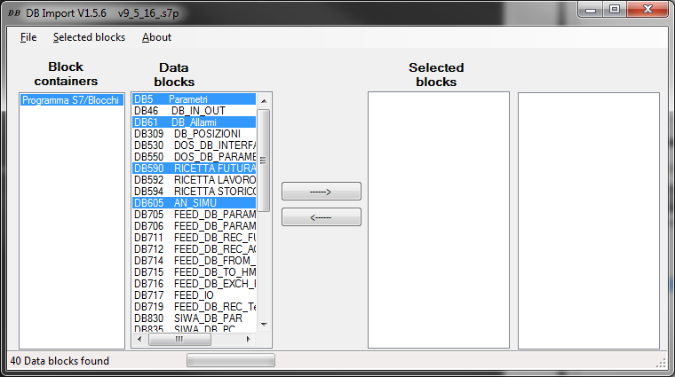
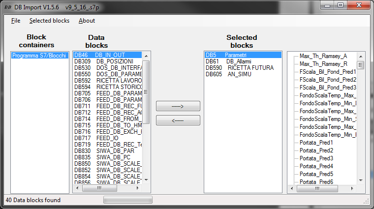
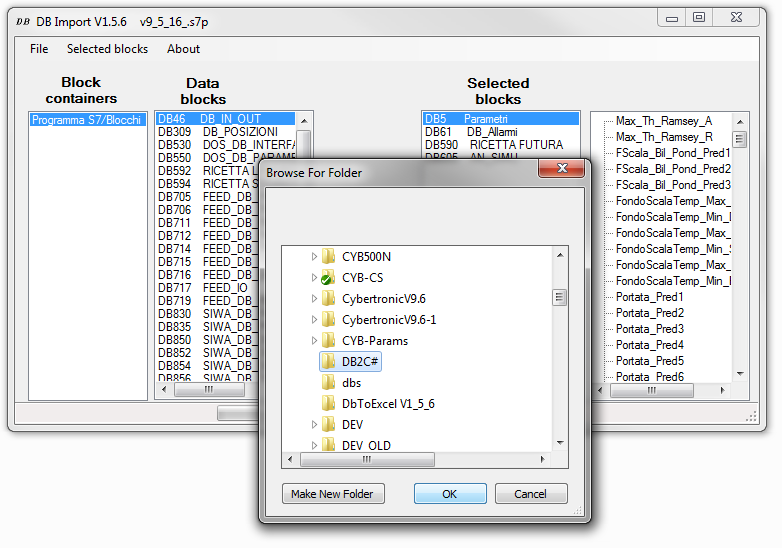
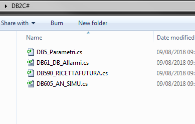

Questo programma deriva dalla decompilazione di questo:

https://sourceforge.net/projects/step7dbtoexcel/

l'originale è un programma che esporta delle DB da un progetto Step 7 in file Excel. È stato riadattato per esportare le DB sotto forma di classi C#, in modo da poterla usare unitamente alla libreria S7.Net per IO con il PLC.

Per poter compilare correttamente la soluzione si deve aprire con Visual Studio 2017, in quanto usa delle funzionalità C# non presente nel 2013.

Al primo avvio il programma si presenta così:



dal menu File possiamo ricercare un progetto S7 da aprire:



da quì possiamo selezionare le DB che vogliamo esportare e clickare sul pulsante -->





infine dal menu `Selected Blocks` scegliamo `Create C# Source` per esportare le DB selezionate, verrà chiesto in quale cartella esportare 





Esempio di output:

```C#
namespace S7Cyb
{	
	/// <summary>
	///  
	/// </summary>
	using System;
	using System.Collections.Generic;
	using System.Linq;
	using System.Xml;
	
	[S7DB(DB = 5)]
	public class Parametri: DBBase // DB5
	{
	
		/// <summary>
		/// Max T/h Ramsey aggregati
		/// </summary>
		[S7Tag( Address = "DBD 0" )]
		public double Max_Th_Ramsey_A { get; set; }
	
	
		/// <summary>
		/// Max T/h Ramsey riciclato
		/// </summary>
		[S7Tag( Address = "DBD 4" )]
		public double Max_Th_Ramsey_R { get; set; }
	
	
		/// <summary>
		/// Valore di FondoScala bilancia predosatore 1
		/// </summary>
		[S7Tag( Address = "DBD 8" )]
		public double FScala_Bil_Pond_Pred1 { get; set; }
	
	
		/// <summary>
		/// Valore di FondoScala bilancia predosatore 2
		/// </summary>
		[S7Tag( Address = "DBD 12" )]
		public double FScala_Bil_Pond_Pred2 { get; set; }
	
	
		/// <summary>
		/// Valore di FondoScala bilancia predosatore 3
		/// </summary>
		[S7Tag( Address = "DBD 16" )]
		public double FScala_Bil_Pond_Pred3 { get; set; }
```

Le classi generate devono essere usate unitamente alla libreria S7.Net presente nella stessa soluzione: tale libreria è la stessa S7.Net di nuget, ma contiene alcune estensioni e correzioni per poter utilizzare le classi autogenerate dal programma.
